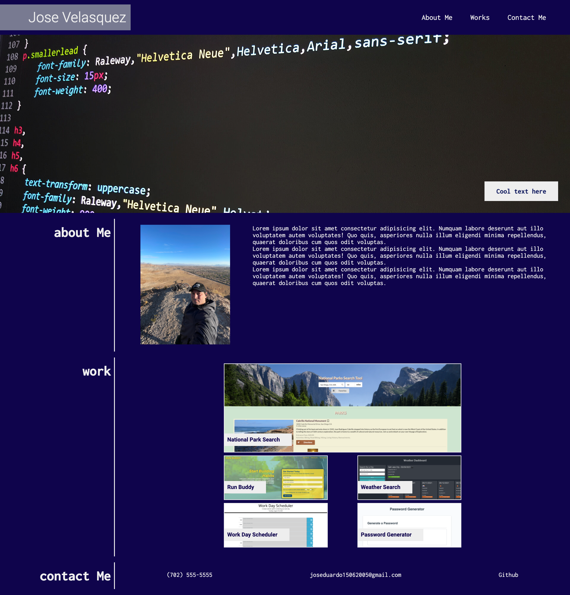

# Portafolio Website

## Purpose

Create a portfolio website using my knowledge about HTML, CSS acquire in my current Web Bootcamp.

## Built With

- HTML
- HTML Semantics Tags
- CSS
- CSS Flex

## Website

https://joseduardo15062005.github.io/portafolio/

## Screenshot

## Contribution

Made with ❤️ by [joseduardo]
